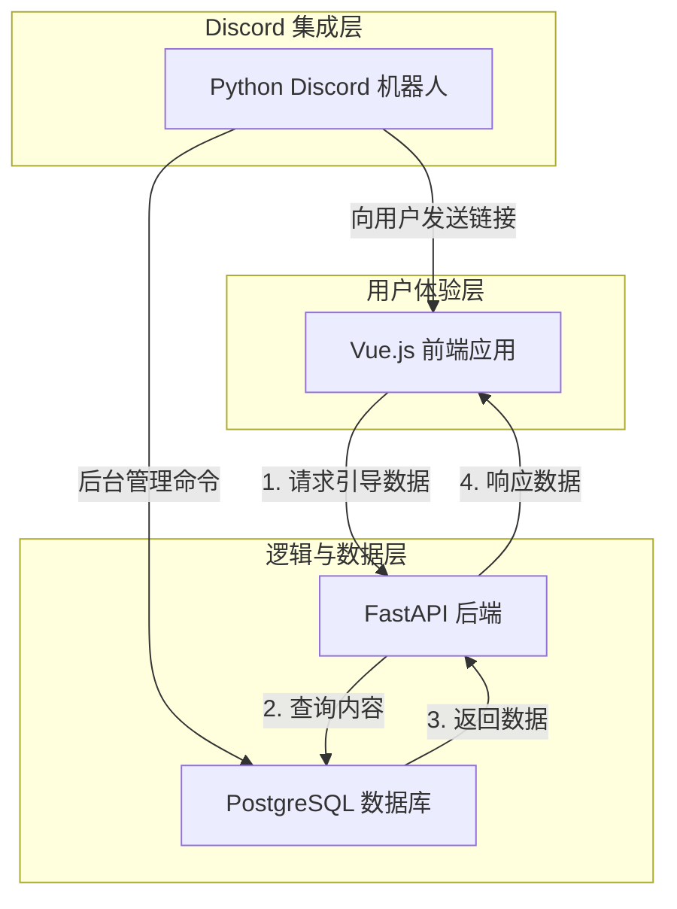
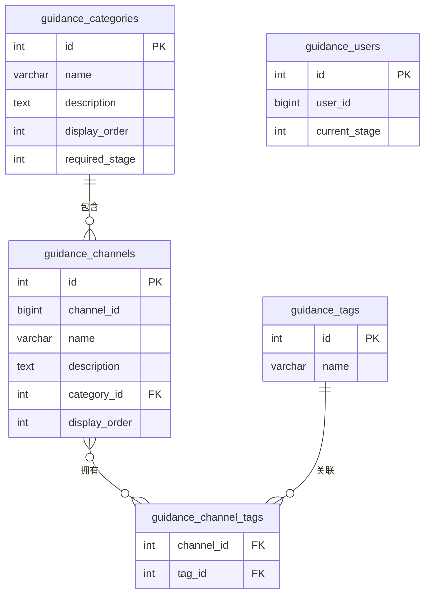

# Guidance 系统架构设计蓝图

## 1. 核心愿景

我们致力于为新用户提供一种前所未有的、沉浸式的服务器探索体验。为此，我们将彻底重构现有的 `guidance` 系统，用一个定制化的、在 Discord 内嵌的**交互式 Web 应用**来替代传统的引导流程。

**核心目标:**

-   **体验革新**: 创造一个品牌化的、高度交互的、视觉丰富的引导网页，让新用户以最直观的方式了解服务器的魅力。
-   **个性化路径**: 实现**两段式引导**。根据用户在服务器中的不同身份阶段（例如，“缓冲区”与“已验证”），动态地展示和解锁不同的内容，引导用户逐步深入社区。
-   **敏捷内容管理**: 引导内容将与代码完全分离，通过后台进行动态管理，使服务器的运营调整能即时反映在引导体验中。

## 2. 技术架构

为实现此愿景，我们采用**三端分离**的全栈技术架构。

-   **前端 (Frontend)**
    -   **技术栈**: **Vue.js**
    -   **角色**: 承担所有用户交互和视觉呈现的责任。它是一个独立的单页应用 (SPA)，负责动态渲染从后端获取的引导内容，并部署为静态网站。

-   **后端 (Backend)**
    -   **技术栈**: **FastAPI** (Python) + **PostgreSQL** (数据库)
    -   **角色**: 作为数据和业务逻辑的核心。它为前端提供 RESTful API，根据请求（例如用户所处的引导阶段）返回相应的引导数据。

-   **机器人 (Discord Bot)**
    -   **技术栈**: **discord.py** (现有项目)
    -   **角色**: 充当连接用户与 Web 应用的“桥梁”和“后台入口”。
        1.  **触发器**: 监听用户的身份变化，并在关键节点（如获得新角色）向用户私信发送一个指向前端 Web 应用的链接。
        2.  **内容管理器**: 提供一组管理员专用的斜杠命令，用于增、删、改、查 PostgreSQL 数据库中的引导内容。

## 3. 实现方法

我们将通过以下核心方法来实现这一架构：

-   **阶段化内容接口 (Staged Content API)**: 后端将提供一个核心 API 端点。前端应用在加载时，会携带标识用户当前引导阶段的参数（例如 `stage=1`）来调用此接口。后端根据此参数，从数据库中查询并返回该阶段用户可见的所有内容（包括分类、频道介绍、教程链接等）。

-   **动态链接触发 (Dynamic Link Trigger)**: 机器人将监听用户的角色变化事件。当用户获得“缓冲区”或“已验证”等关键角色时，机器人会生成一个包含相应阶段参数的 URL (例如 `https://our-app.com/guidance?stage=2`)，并通过一个交互按钮发送给用户。

-   **后台驱动的内容更新 (Backend-Driven Content)**: 管理员无需接触代码。通过在 Discord 中使用机器人提供的 `/guidance admin ...` 等斜杠命令，即可直接操作 PostgreSQL 数据库，实时更新前端网页中显示的所有文本、链接和结构。

## 4. 数据模型 (Database Schema)

为支撑上述功能，后端将采用以下 PostgreSQL 数据库结构。

### 4.1. `guidance_categories` (引导分类表)

-   **用途**: 定义引导内容的大分类，构成前端页面的宏观布局骨架。

| 字段名           | 类型      | 约束/描述                                     |
| ---------------- | --------- | --------------------------------------------- |
| `id`             | `SERIAL`  | **主键**, 自增 ID                             |
| `name`           | `VARCHAR` | **唯一, 非空**. 分类名称 (e.g., "服务器核心") |
| `description`    | `TEXT`    | (可选) 对该分类的详细描述                     |
| `display_order`  | `INTEGER` | **非空**. 用于排序，数字越小越靠前            |
| `required_stage` | `INTEGER` | **非空**. 查看此分类所需的最低阶段 (1 或 2)   |

### 4.2. `guidance_channels` (引导频道表)

-   **用途**: 存储每一个具体的引导项目（通常对应一个 Discord 频道）。

| 字段名          | 类型      | 约束/描述                                  |
| --------------- | --------- | ------------------------------------------ |
| `id`            | `SERIAL`  | **主键**, 自增 ID                          |
| `channel_id`    | `BIGINT`  | **唯一, 非空**. 对应的 Discord 频道 ID     |
| `name`          | `VARCHAR` | **非空**. 在引导页上显示的自定义名称或昵称 |
| `description`   | `TEXT`    | **非空**. 对该频道的介绍和引导说明         |
| `category_id`   | `INTEGER` | **外键**, 关联 `guidance_categories.id`    |
| `display_order` | `INTEGER` | **非空**. 在分类内的排序，数字越小越靠前   |

### 4.3. `guidance_tags` (标签表)

-   **用途**: 存储可供筛选的标签，提供交叉搜索能力。

| 字段名 | 类型      | 约束/描述                              |
| ------ | --------- | -------------------------------------- |
| `id`   | `SERIAL`  | **主键**, 自增 ID                      |
| `name` | `VARCHAR` | **唯一, 非空**. 标签名称 (e.g., "PVP") |

### 4.4. `guidance_channel_tags` (频道-标签关联表)

-   **用途**: 实现频道和标签之间的多对多关系。

| 字段名       | 类型      | 约束/描述                             |
| ------------ | --------- | ------------------------------------- |
| `channel_id` | `INTEGER` | **外键**, 关联 `guidance_channels.id` |
| `tag_id`     | `INTEGER` | **外键**, 关联 `guidance_tags.id`     |
|              |           | **复合主键 (`channel_id`, `tag_id`)** |

### 4.5. `guidance_users` (用户进度表)

-   **用途**: 跟踪用户的引导进度。

| 字段名          | 类型                       | 约束/描述                         |
| --------------- | -------------------------- | --------------------------------- |
| `id`            | `SERIAL`                   | **主键**, 自增 ID                 |
| `user_id`       | `BIGINT`                   | **唯一, 非空**. 用户的 Discord ID |
| `current_stage` | `INTEGER`                  | **非空**. 用户当前阶段 (默认为 1) |
| `created_at`    | `TIMESTAMP WITH TIME ZONE` | 记录创建时间 (默认为 `NOW()`)     |
| `updated_at`    | `TIMESTAMP WITH TIME ZONE` | 记录更新时间 (默认为 `NOW()`)     |

### 4.6. 实体关系图 (ERD)

## 5. 附录：架构决策记录

### 5.1. 项目结构：功能分层 vs. 技术分层

在项目初始化阶段，我们讨论了两种主流的后端文件结构方案：

1.  **技术分层 (Layered Architecture)**: 按代码的技术角色划分文件夹，例如 `models`, `repositories`, `services`, `api`。这是传统的MVC分层思想的延伸。
2.  **功能分层 (Feature-based Architecture)**: 按代码所属的业务功能或领域来划分文件夹，例如 `database`, `web_api`, `bot_commands`。

**决策：**

经过讨论，我们最终为 `guidance_new` 模块选择了 **功能分层** 的结构。

**理由：**

| 评判维度     | 技术分层                                                                                | 功能分层                                                                             | 我们的选择与理由                                                                  |
| :----------- | :-------------------------------------------------------------------------------------- | :----------------------------------------------------------------------------------- | :-------------------------------------------------------------------------------- |
| **内聚性**   | **低**。修改一个功能可能需要同时更改 `models`, `services`, `api` 等多个文件夹下的文件。 | **高**。一个功能（如 Web API）的所有代码都集中在同一个 `web_api` 文件夹下。          | **功能分层胜出**。开发某一特定功能时，代码上下文切换成本极低。                    |
| **耦合度**   | **高**。各技术层之间紧密依赖，难以独立测试或替换。                                      | **低**。`web_api` 和 `bot_commands` 之间完全解耦，它们只共同依赖于 `database` 层。   | **功能分层胜出**。我们可以独立开发和维护Web后端与机器人后台，互不影响。           |
| **可维护性** | **一般**。当项目变大，`services` 等文件夹会变得异常臃肿，难以导航。                     | **高**。新增功能只需新增文件夹，不会影响现有结构。项目结构随业务增长而清晰扩展。     | **功能分层胜出**。该结构能更好地适应我们未来可能增加的新功能。                    |
| **直观性**   | **一般**。反映了“代码是什么”，但不能直接反映“代码做什么”。                              | **高**。文件夹名称直接对应业务功能，对于新加入的开发者非常友好，能快速理解项目全貌。 | **功能分层胜出**。结构清晰地映射了我们的三大核心组件：数据、Web服务、机器人交互。 |

综上所述，功能分层架构能为本项目带来更清晰的职责划分、更低的维护成本和更强的扩展性，是本次重构的最佳选择。