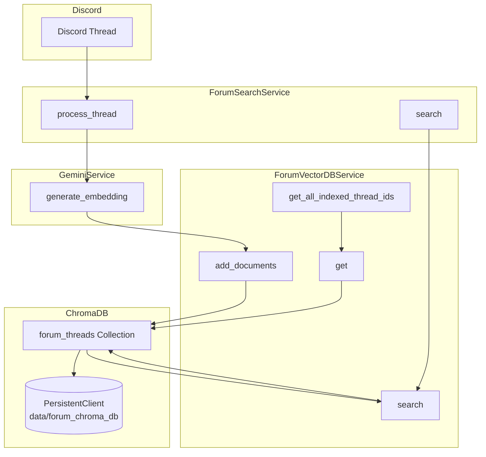
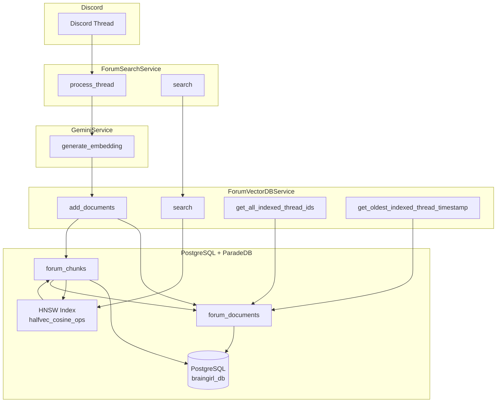
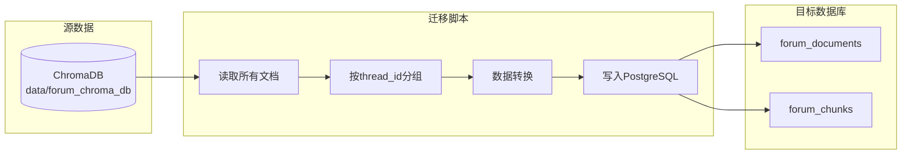

# 论坛帖子向量迁移架构图

## 当前架构 (ChromaDB)

## 目标架构 (PostgreSQL)

## 数据迁移流程

## 服务接口对比

### ForumVectorDBService 接口变化

| 功能               | ChromaDB 实现                                          | PostgreSQL 实现                                   |
| ------------------ | ------------------------------------------------------ | ------------------------------------------------- |
| 初始化             | `chromadb.PersistentClient(path)`                      | `AsyncSessionLocal`                               |
| 添加文档           | `add_documents(ids, documents, embeddings, metadatas)` | `add_documents(thread_data, chunks_data)`         |
| 搜索               | `search(query_embedding, n_results, where_filter)`     | `search(query_embedding, n_results, filters)`     |
| 获取文档           | `get(where, include)`                                  | SQL查询                                           |
| 获取所有帖子ID     | `get_all_indexed_thread_ids()`                         | `get_all_indexed_thread_ids()`                    |
| 获取最旧帖子时间戳 | `get_oldest_indexed_thread_timestamp(channel_id)`      | `get_oldest_indexed_thread_timestamp(channel_id)` |

### 数据结构对比

| ChromaDB                            | PostgreSQL                |
| ----------------------------------- | ------------------------- |
| 单一集合存储所有块                  | 文档表 + 分块表           |
| 元数据存储在metadata字段            | 元数据作为独立列          |
| ID格式: `{thread_id}:{chunk_index}` | document_id + chunk_index |
| 嵌入向量: List[float]               | HALFVEC(3072)             |
| 时间戳: ISO字符串 + Unix浮点数      | DateTime + Float          |

## 迁移后的优势

1. **统一数据存储**: 所有向量数据都在PostgreSQL中，便于管理
2. **更好的查询性能**: PostgreSQL的HNSW索引性能优秀
3. **事务支持**: 可以使用ACID事务保证数据一致性
4. **全文搜索**: 可以结合BM25进行混合搜索
5. **减少依赖**: 减少对ChromaDB的依赖
6. **更好的扩展性**: PostgreSQL支持水平扩展
